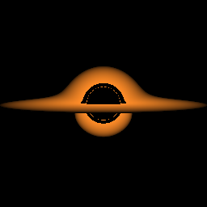

# rust-geodesic-raytracer

CPU ray tracer for null geodesics in the Schwarzschild spacetime using Kerr-Schild Cartesian coordinates.

The renderer integrates the Hamiltonian null geodesic equations with a fixed-step implicit midpoint method and projects the covariant time momentum each step to control the null constraint.

## Build and run

Default render (800x800):

	cargo run --release

The output is written to output.png in the current directory.

## Options

	cargo run --release -- --width 800 --height 800 --m 1.0 --fov-deg 40 --step-h 0.03

Note: camera position and look-at values passed via --cam-pos and --cam-look are interpreted in units of M and are multiplied by m internally.

Debug a single pixel ray and print diagnostics:

	cargo run --release -- --debug-ray 400 400

Camera controls:

	cargo run --release -- --cam-pos 30 0 6
	cargo run --release -- --cam-look 0 0 0
	cargo run --release -- --cam-up 0 1 0

Default render uses a black sky and an emissive equatorial accretion disk.

Select sky mode:

	cargo run --release -- --sky black
	cargo run --release -- --sky checker
	cargo run --release -- --sky stars

Disk plus starfield example:

	cargo run --release -- --sky stars --fov-deg 80 --outfile output_disk_stars.png

Disable the disk:

	cargo run --release -- --no-disk

Disk thickness responsiveness:

	cargo run --release -- --disk-half-thickness 0.05
	cargo run --release -- --disk-half-thickness 0.5

Optional disk radii (in units of M):

	cargo run --release -- --disk-r-in 6 --disk-r-out 20

## Quick manual tests

1. Default classic render:

	cargo run --release

2. Debug sky (lensed checkerboard):

	cargo run --release -- --sky checker --no-disk

3. Thickness responsiveness:

	cargo run --release -- --disk-half-thickness 0.05
	cargo run --release -- --disk-half-thickness 0.5

Tuning commands:

	cargo run --release -- --cam-pos 30 0 3
	cargo run --release -- --cam-pos 30 0 12
	cargo run --release -- --disk-half-thickness 0.25
	cargo run --release -- --fov-deg 30

## Example

Zoomed-out accretion disk framing (fast preview resolution):

	cargo run --release -- --width 256 --height 256 --outfile quick_classic_zoomedout.png --sky black
